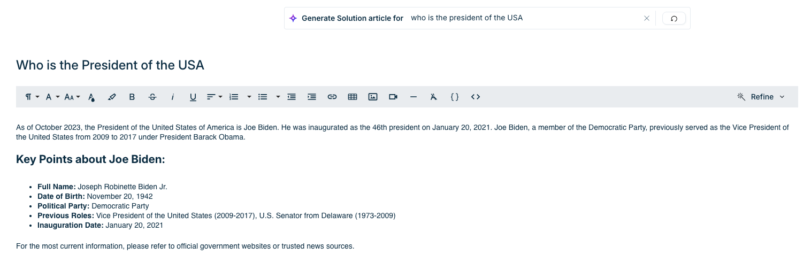
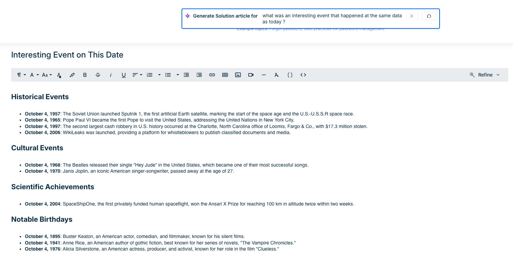
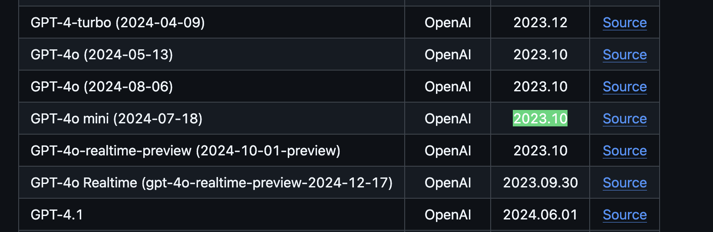

# TIL: How to Fingerprint an LLM Using Its Knowledge Cutoff Date

While doing bug bounty recon on a target with AI features, I noticed the model felt noticeably less capable than what I'm used to. I wanted to identify which model family it belonged to, knowing that would let me research known jailbreaks and weaknesses specific to it.

The model had guardrails blocking anything outside the platform's scope. I found an article creation feature that seemed more permissive, but it still deflected any prompts asking about the model itself or its system prompt.

After some brainstorming i tried the following

## Step 1: Identify the Cutoff Year

I started with a simple, innocuous question:

> Who is the current US president?

The answer pointed to a cutoff somewhere around October 2023.

## Step 2: Pin Down the Exact Date

To get more precise, I followed up with:

> What was an interesting event that happened at the same date as today ?

and got October 4th, 2023

## Step 3: Cross-Reference Against Known Model Cutoffs

I matched that date against this GitHub repo that tracks LLM knowledge cutoff dates across model families:
[https://github.com/HaoooWang/llm-knowledge-cutoff-dates](https://github.com/HaoooWang/llm-knowledge-cutoff-dates)

October 2023 narrowed it down to a few candidates: GPT-4 family members, Mistral 3, and Phi 4.

## Step 4: Confirm With Model-Specific Knowledge Probes

To break the tie, I had the article generator write about the latest releases from each company.
It drew a blank on Mistral and Phi but handled OpenAI's GPT-4 correctly, confirming it was a GPT-4 family model.

